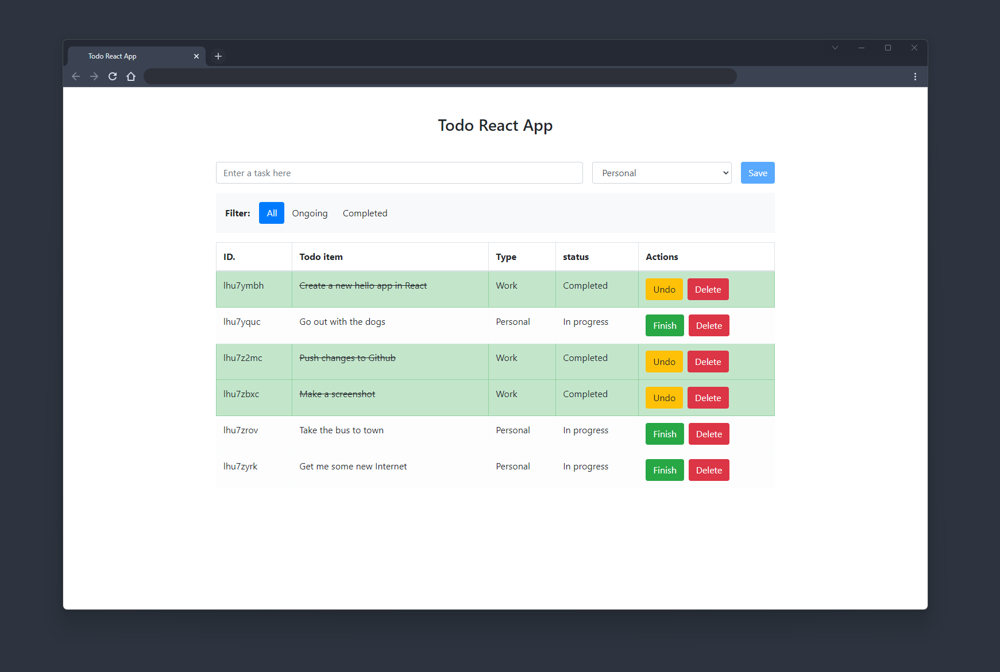

# The hello world for React app

I developed a Hello World app for React—a Todo list—representing my second implementation of the code. I utilized a powerful stack including Bootstrap (template), React, Vite, JSON server, and TypeScript.

